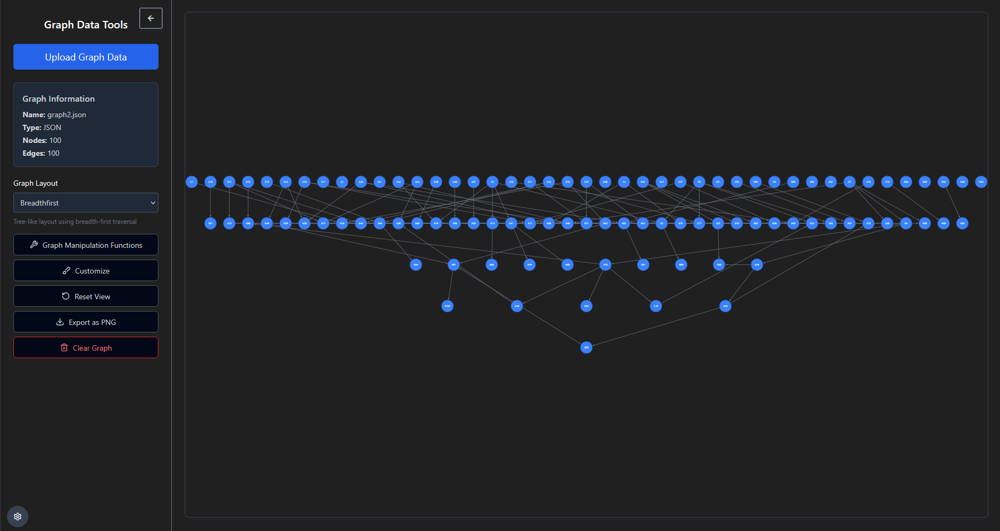
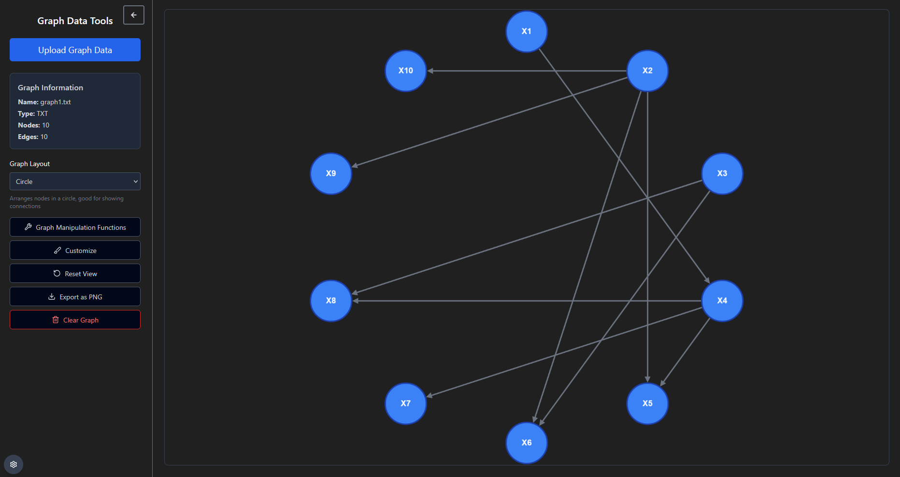
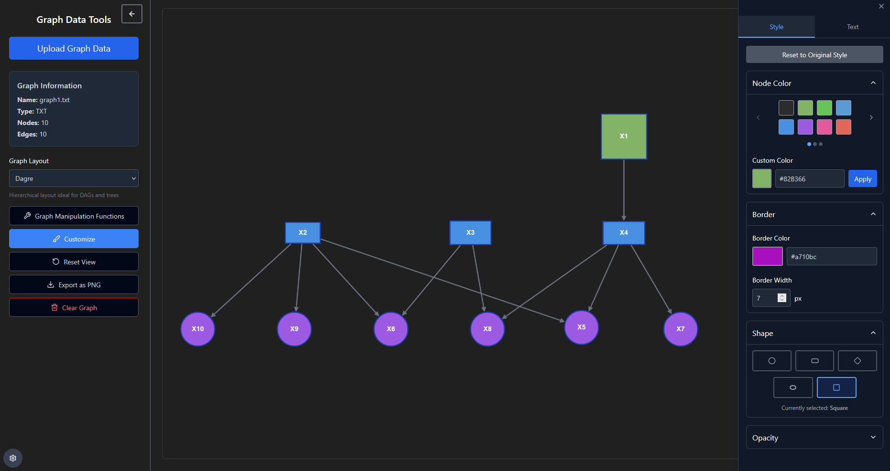

# DAG Visualizer

> Interactive web-based tool for visualizing and exploring Directed Acyclic Graphs (DAGs) with focus on causal models

[]()

## Features

- **Multiple Input Formats** - Support for Tetrad `.txt` and `.json` files
- **Interactive Visualization** - Pan, zoom, drag nodes with smooth animations  
- **Layout Algorithms** - Dagre, Circle, Concentric, Grid, Breadth-first, CoSE
- **Customization Tools** - Node colors, shapes, borders, opacity controls
- **Export Options** - Save graphs as PNG images
- **Real-time Manipulation** - Live graph editing and exploration

## Screenshots

### Hierarchical Layout View
*[Screenshot of the main interface with hierarchical DAG layout]*



### Circular Layout with Customization Panel
*[Screenshot showing circular layout and customization options]*



### Large Graph Visualization
*[Screenshot of complex graph with 100+ nodes]*



## Installation

```bash
# Clone the repository
git clone https://github.com/gstatnikov/dag-visualizer.git

# Navigate to project directory
cd dag-visualizer

# Open in browser (or use local server)
open index.html
```

## Usage

### Supported File Formats

#### TXT Format (Tetrad-compatible)
```
Graph Nodes:
X1;X2;X3;X4;X5;X6;X7;X8;X9;X10

Graph Edges:
1. X1 --> X4
2. X2 --> X5
3. X2 --> X6
```

#### JSON Format
```json
{
  "graph": {
    "nodes": [...],
    "edgesSet": [...],
    "attributes": {}
  }
}
```

### Quick Start

1. **Upload Data** - Click "Upload Graph Data" button
2. **Choose Layout** - Select from available layout algorithms
3. **Customize** - Modify colors, shapes, and styling
4. **Explore** - Pan, zoom, and interact with your graph
5. **Export** - Save as PNG when ready

## Roadmap

### Customization Enhancements
- [ ] Pre-load node-specific colors and shapes
- [ ] SVG/PDF export with transparency
- [ ] Multi-tab interface for graph comparison

### Graph Analysis Tools
- [ ] Subgraph extraction (k-hop neighborhoods)
- [ ] Path analysis between variables
- [ ] Node type-aware grouping
- [ ] Interactive filtering and search

### Causal Analysis Features
- [ ] Backdoor criterion implementation
- [ ] Front-door criterion support
- [ ] Pearl's causal algorithms
- [ ] Intervention target optimization
- [ ] Weighted edge visualization

### Data Integration
- [ ] Multiple file format support
- [ ] Statistical package integration
- [ ] Model fit visualization
- [ ] Batch processing capabilities

## Technology Stack

- **Frontend**: HTML5, CSS3, Vanilla JavaScript
- **Visualization**: [Cytoscape.js](https://cytoscape.org/)
- **Layouts**: Dagre, CoSE, and Cytoscape extensions
- **File Handling**: Native File API

## Contributing

Contributions welcome! Areas of focus:

- **Algorithm Implementation** - Causal analysis methods
- **UI/UX Improvements** - Better user experience
- **Performance** - Large graph optimization
- **Documentation** - Code comments and examples

### Development Setup

```bash
# Fork the repository
git fork https://github.com/gstatnikov/dag-visualizer.git

# Create feature branch
git checkout -b feature/awesome-feature

# Make changes and commit
git commit -m "Add awesome feature"

# Push to branch
git push origin feature/awesome-feature
```

## Related Projects

- [Tetrad](https://www.cmu.edu/dietrich/philosophy/tetrad/) - Causal discovery platform
- [DAGitty](https://www.dagitty.net/) - Online DAG editor  
- [Cytoscape](https://cytoscape.org) - Network analysis platform
- [igraph](https://igraph.org) - Graph analysis library

## License

This project is currently under active development. All rights reserved. Please contact the repository owner for usage permissions.

## About

Part of ongoing research in explainable AI for causal model understanding. Designed for researchers, data scientists, and anyone working with causal inference and directed acyclic graphs.
